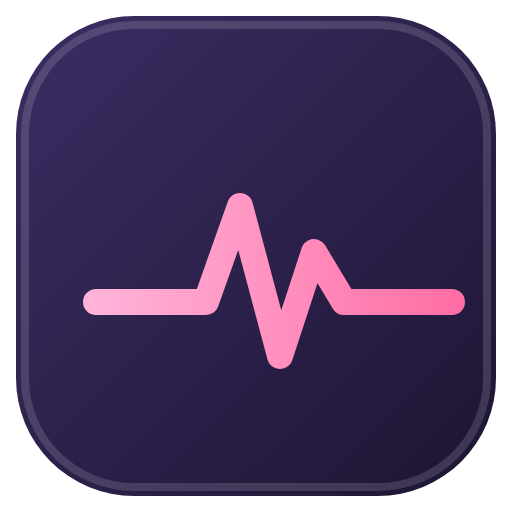

<div align="center">
  
  <h1>Cutieboard 💓</h1>
  <p>A tiny btop-inspired system monitor that lives in VS Code's Explorer sidebar.</p>
</div>

CPU, memory, NVIDIA GPU, temperature, and power telemetry — right beside your file tree, no editor tab required. Zero dependencies, everything sampled locally on your machine.

```
host · up 3h12m · 14:02:11 · ● live
CPU  23.4% [██████░░░░] ▂▅▃▇   16T · L 1.20/0.90/0.70 · temp 61°C
MEM  58.1% [████████░░] ▃▅▅▆   used 9.3G · free 6.7G · total 16.0G
GPU  75.0% [█████████░] ▅▇▆█   VRM 50.0% 4.0G/8.0G · temp 68°C · power 82.5W
PWR  70.0W   CPU 25W  GPU 30W · system total
```

## Features

- **CPU** — utilization with rolling history, thread count, load averages, processor model, and package temperature when a sensor is readable
- **Memory** — utilization with rolling history plus used / free / total (labeled `unified` on Apple Silicon, where one pool serves CPU and GPU)
- **GPU** — NVIDIA utilization, VRAM usage, temperature, and power via `nvidia-smi`; the whole section hides itself when no NVIDIA tooling is present, so it never shows junk
- **Power** — live device or component wattage with CPU/GPU breakdown and source label (`system total`, `battery draw`, or `available components`)
- **System strip** — hostname, uptime, live/paused/error state, and last-sample time
- **Native controls** — refresh, pause, and resume buttons right in the view title, plus a `Cutieboard: Focus Monitor` command to jump to the panel
- **Always sampling** — keeps collecting every couple of seconds even when the view is collapsed, with overlap protection so slow sensors can't pile up

## Install

**From the VSIX (recommended)**

1. Grab `cutieboard-0.0.1.vsix` from the repo (or build it yourself — see below).
2. In VS Code: **Extensions → … → Install from VSIX…** and pick the file.
3. Open the **Explorer** sidebar and expand **Cutieboard**.

**Run from source**

1. Open this folder in VS Code.
2. Press `F5` and choose **Run Cutieboard**.
3. In the Extension Development Host window, open Explorer and expand **Cutieboard** near the bottom of the sidebar.

## Usage

| Action | How |
|---|---|
| Reveal the monitor | Command Palette → **Cutieboard: Focus Monitor** |
| Sample right now | view-title **Refresh** button (works even while paused) |
| Pause / resume | view-title **Pause** / **Resume** buttons |
| Change the interval | set `cutieboard.refreshInterval` (1000–10000 ms, default 2000) |

Paused state is reflected in the status dot (`live` → `paused`) and in the view-title buttons. If a sample ever fails, the panel shows an `error` state with the message instead of going blank.

## Platform support

CPU and memory work everywhere via Node's system APIs. Temperature, power, and GPU telemetry are best-effort — when the OS doesn't expose a sensor, that field quietly shows as unavailable instead of failing.

| Telemetry | Linux | macOS | Windows |
|---|---|---|---|
| CPU / memory | ✅ | ✅ | ✅ |
| CPU temperature | ✅ via hwmon (`coretemp`, `k10temp`, `zenpower`, …) | ⚠️ needs `osx-cpu-temp` or privileged `powermetrics` | ⚠️ via WMI thermal zone (often unexposed by firmware) |
| Power | ✅ via RAPL / battery discharge / NVIDIA | ✅ battery via `ioreg`+`pmset`; CPU/GPU via privileged `powermetrics` | ✅ battery discharge via WMI |
| GPU | ✅ via `nvidia-smi` | hidden (no public Apple GPU utilization CLI) | ✅ via `nvidia-smi` if installed |
| Unified memory | — | ✅ MEM covers the shared pool; no separate VRAM meter | — |

**macOS notes**

- On MacBooks, battery discharge power works with zero setup.
- CPU temperature and `powermetrics` CPU/GPU power need privileges: install [`osx-cpu-temp`](https://github.com/lavoiesl/osx-cpu-temp) for temperature, or grant `powermetrics` access for full readings.
- On Apple Silicon there is no separate VRAM pool, so Cutieboard labels memory `unified` and hides the VRAM row rather than counting the same gigabytes twice.

**Windows notes**

- Battery discharge power works with zero setup on laptops (WMI `BatteryStatus`); on desktops without a battery, power shows as unavailable.
- CPU temperature comes from the WMI thermal zone, which many firmwares don't expose — expect `--°C` on those machines rather than an error.

## How it works

Four small modules, no dependencies beyond Node builtins and the VS Code API:

| File | Job |
|---|---|
| `extension.js` | activation, metric collection orchestration, webview provider, commands |
| `system-sensors.js` | OS sensor collectors — Linux hwmon/RAPL/battery, macOS `powermetrics`/`ioreg`/`pmset`, Windows WMI thermal-zone/battery |
| `monitor-core.js` | pure logic — CPU math, NVIDIA parsing, power merging, sampling, history store |
| `monitor-view.js` | the Explorer webview HTML/CSS/JS (strict CSP with per-load nonce) |

Nothing ever leaves your machine: no network calls, no telemetry, no accounts.

## Development

```bash
npm run check    # syntax-check all modules
npm test         # full unit suite (node --test)
npm run package  # build cutieboard-0.0.1.vsix with vsce
```

## License

MIT — see the `LICENSE` file.
