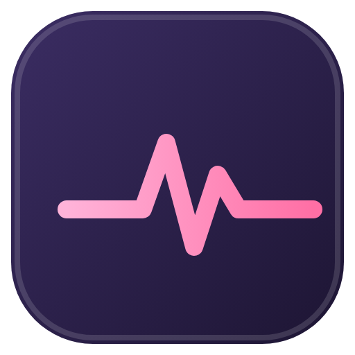
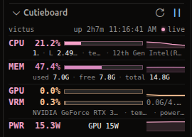

<p align="center">
  
</p>

<h1 align="center">cutieboard</h1>

<p align="center">
  A small btop-style system monitor that lives in the Explorer sidebar,<br>
  underneath your files. CPU, memory, GPU, temperature, and power —<br>
  sampled locally, every two seconds, with nowhere to phone home to.
</p>

<p align="center">
  
</p>

<p align="center">
  <strong>No editor tab. No dashboard. Just glance left.</strong>
</p>

<p align="center">
  <a href="#install">Install</a> ·
  <a href="#use">Use</a> ·
  <a href="#platform-notes">Platform notes</a> ·
  <a href="#hacking">Hacking</a>
</p>

---

## What it is

An Explorer view that samples only while it's on screen. Collapse it or
switch to another sidebar and it stops completely — no `nvidia-smi`, no
PowerShell, no laptop GPU kept awake for nobody. The 60-sample sparkline
history is still there when you come back, and the first sample after you
return is measured fresh rather than averaged over the time it was hidden.

What you get per row is deliberately spare: a percentage, a bar, a
sparkline, and one line of context. Anything the OS won't tell you shows
as `--`, never as an error and never as a made-up number.

What it isn't: a task manager, a profiler, or a menu-bar widget. It won't
tell you which process is eating RAM. It tells you the machine is warm.

## Install

Build the VSIX and install it — the packaged file is gitignored, so there
is nothing to download from the repo itself:

```bash
npm run package
```

Then in VS Code: **Extensions → … → Install from VSIX…** and pick the
generated `cutieboard-0.1.0.vsix`. The view appears at the bottom of the
Explorer sidebar.

Or run it from source:

```bash
git clone https://github.com/adityasasidhar/cutieboard.git
# open the folder in VS Code, press F5 → "Run Cutieboard"
```

In the Extension Development Host window, expand **Cutieboard** in the
Explorer.

Requirements: VS Code `^1.85.0`. Nothing else — no npm dependencies,
just Node builtins and the VS Code API.

## Use

| Want | Do |
| :--- | :--- |
| **Open it** | Command Palette → **Cutieboard: Focus Monitor** |
| **Sample now** | **Refresh** button in the view title (fires even while paused) |
| **Pause / resume** | **Pause** / **Resume** buttons in the view title |
| **Slow it down** | Set `cutieboard.refreshInterval` |

```jsonc
// settings.json
{
  "cutieboard.refreshInterval": 2000 // ms, clamped to 1000–10000
}
```

The status dot tells you the state at a glance: `● live`, `● paused`,
`● error` (with the message inline, instead of a blank panel).

## Platform notes

CPU and memory work everywhere through Node's `os` module. Everything
else depends on what your OS is willing to expose — missing sensors
degrade to `--`, by design.

| Metric | Linux | macOS | Windows |
| :--- | :--- | :--- | :--- |
| **CPU / memory** | yes | yes; memory via `vm_stat` (counts reclaimable pages) | yes |
| **CPU temp** | hwmon (`coretemp`, `k10temp`, `zenpower`…) | needs `osx-cpu-temp` or privileged `powermetrics` | WMI thermal zone, often admin-only — expect `--°C` |
| **Power** | RAPL (root-only on most distros) / battery `power_now`, `current_now` × `voltage_now`, or the `energy_now` drain rate / NVIDIA | battery via `ioreg` + `pmset`; CPU/GPU via privileged `powermetrics` | battery discharge via WMI (laptops; desktops show `--`) |
| **GPU** | `nvidia-smi`; a runtime-suspended laptop dGPU shows `sleep` and is left asleep | hidden — no public Apple GPU utilization CLI | `nvidia-smi`, if installed |

External tools that are missing, need root, or print nothing are retried
every 5 minutes, not on every sample. Windows runs all its WMI queries in
a single PowerShell process at most every 10 seconds, because starting
PowerShell costs more CPU than the readings are worth.

On Linux laptops with NVIDIA runtime power management (Optimus/RTD3),
Cutieboard reads the GPU's power state from sysfs before touching it.
Running `nvidia-smi` wakes a sleeping dGPU (about 1.8 s and several watts on
an RTX 3050 Laptop GPU), so a suspended GPU just shows `sleep`. An awake but
idle GPU is re-queried at most every 10 seconds so it can go back to sleep.
`nvidia-smi` on Windows can't be asked first, so it is queried every sample
while the view is visible.

Two Apple Silicon specifics: memory is labeled `unified` because one pool
serves CPU and GPU, and the VRAM row hides instead of counting the same
gigabytes twice. On machines without `nvidia-smi` the whole GPU section
hides itself.

Power readings have a pecking order: a platform/battery figure wins as the
system total; otherwise whatever CPU and GPU readings exist are summed and
labeled `gpu only`, `cpu only` or `cpu + gpu` with `no system total`, so a
GPU-only figure is never mistaken for the whole machine. An `nvidia-smi`
power draw always beats a sensor guess for the GPU slice.

## How it's built

Four files, no dependencies:

```
src/extension.js       activation, orchestration, webview provider, commands
src/system-sensors.js  collectors — hwmon/RAPL/battery, powermetrics/ioreg/pmset, WMI
src/monitor-core.js    pure logic — CPU math, NVIDIA parsing, power merge, sampler, history
src/monitor-view.js    the webview — one HTML file, inline script, strict nonce CSP
```

Sampling is a guarded loop that runs only while the view is visible: a
timer fires every `refreshInterval`, slow sensors can't overlap thanks to
an in-flight guard, and pausing skips everything except a forced refresh.
The extension activates when the view is first shown, not at editor
startup. History holds 60 samples per metric;
GPU and power tracks reset to empty (not stale) when their sensors vanish.

The view inherits your theme — sidebar colors, editor font, terminal
ANSI accents — so it looks native in light mode, dark mode, and whatever
pink-on-black theme you're running at 2am.

## Hacking

```bash
npm run check                  # syntax-check all four modules
npm test                       # full suite — node:test, no framework
node --test test/<name>.test.js  # one suite
```

Tests inject fakes (a vscode double, stubbed `os`/`fs`/`execFile`) and
never touch `/sys` or spawn real subprocesses. New DOM ids in the webview
need matching render code plus test coverage — the CSP allows no external
resources, so everything stays in the single nonced inline script.

## License

MIT — see [`LICENSE`](LICENSE).
